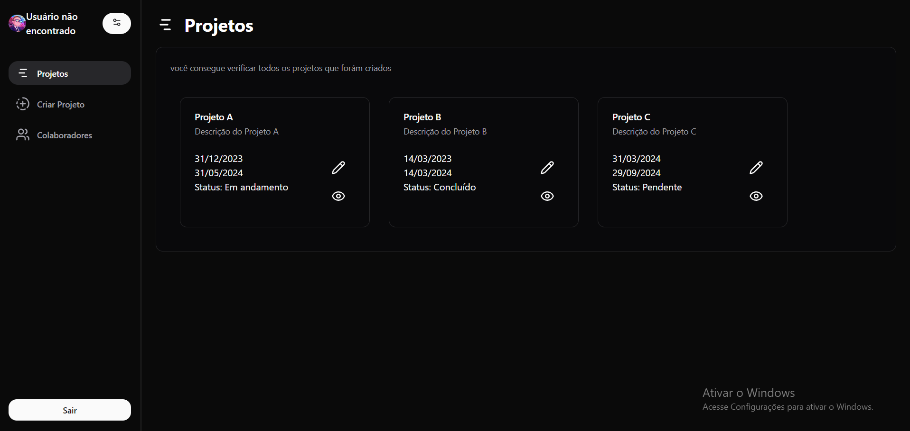

# Teste para FALAE



Este projeto está dividido em duas partes: **frontend** e **backend**.


## Tecnologias Utilizadas

- **Frontend:**
  - TypeScript
  - React
  - Tailwind CSS
  - Shadcn UI
  - Axios

- **Backend:**
  - Node.js
  - TypeScript
  - Express
  - MySQL2
  - JWT

## Configuração do Banco de Dados

O banco de dados está hospedado na AWS. Para conectar ao banco, você precisará configurar um arquivo `.env` com os seguintes dados:

```
DB_HOST=database-flslab.cb6ayoocw69o.us-east-2.rds.amazonaws.com
DB_USER=root
DB_PASS=dlg7843d2
DB_NAME=fullstackaws
JWT_TOKEN=F4T0DhrBz3cYh0C9w1jJkq5r7eN8Lm2oQxv9k6U1rH8Zp3G7sV0tOaK4lN5F6Wz
```

## Como Rodar o Projeto

### Frontend

Para iniciar o frontend, execute o seguinte comando:

```bash
npm run dev
```

### Backend

Para iniciar o backend, execute o seguinte comando:

```bash
npx ts-node src/server.ts
```

---
